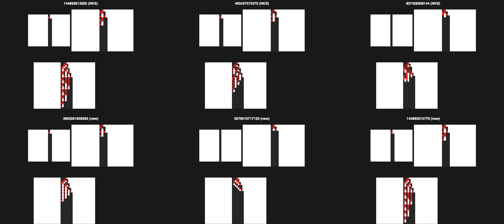

# CellularAutomaton Paclet — Introduction

This notebook demonstrates the functionality of the **CellularAutomaton** paclet, which provides Rust-accelerated 1D cellular automaton simulation and search.

## Setup

```wolfram
PacletInstall["https://www.wolframcloud.com/obj/nikm/CellularAutomaton.paclet", ForceVersionInstall -> True]
Get["WolframInstitute`CellularAutomaton`"]
```

## Rule Count

`CellularAutomatonRuleCount[k, r]` returns the total number of distinct rules for `k` colors and radius `r`.

```wolfram
CellularAutomatonRuleCount[2, 1]
```

```wolfram
CellularAutomatonRuleCount[3, 1]
```

## Evolution

`CellularAutomatonEvolution[rule, init, steps]` returns the full spacetime matrix (initial state + each subsequent generation).

```wolfram
CellularAutomatonEvolution[30, {0, 0, 0, 0, 0, 1, 0, 0, 0, 0, 0}, 5] // MatrixForm
```

For general CAs with `k` colors and radius `r`:

```wolfram
CellularAutomatonEvolution[30, 2, 1, {0, 0, 0, 0, 0, 1, 0, 0, 0, 0, 0}, 5] // MatrixForm
```

## Output (Final State)

`CellularAutomatonOutput[rule, init, steps]` returns only the final generation.

```wolfram
CellularAutomatonOutput[30, {0, 0, 0, 0, 0, 1, 0, 0, 0, 0, 0}, 3]
```

```wolfram
CellularAutomatonOutput[110, {0, 0, 0, 0, 0, 1, 0, 0, 0, 0, 0}, 3]
```

## Visualization

`CellularAutomatonPlot[rule, width, steps]` renders the spacetime diagram as an `ArrayPlot`.

### Elementary CA Examples

```wolfram
CellularAutomatonPlot[30, 101, 50, ImageSize -> 400]
```

```wolfram
CellularAutomatonPlot[110, 101, 50, ImageSize -> 400]
```

```wolfram
CellularAutomatonPlot[90, 101, 50, ImageSize -> 400]
```

### Comparing Multiple Rules

```wolfram
Grid[Partition[
  Table[CellularAutomatonPlot[r, 51, 25, ImageSize -> 200], {r, {30, 54, 60, 90, 110, 150}}],
  3
], Spacings -> 1]
```

## Rule Search

`CellularAutomatonSearch[init, steps, target]` finds all elementary CA rules whose evolution from `init` produces `target` after the given number of steps.

```wolfram
(* Find rules that produce the same output as Rule 30 after 1 step *)
target30 = CellularAutomatonOutput[30, {0, 0, 0, 1, 0, 0, 0}, 1];
CellularAutomatonSearch[{0, 0, 0, 1, 0, 0, 0}, 1, target30]
```

```wolfram
(* Find rules that produce the same output as Rule 110 after 2 steps *)
target110 = CellularAutomatonOutput[110, {0, 0, 0, 1, 0, 0, 0}, 2];
CellularAutomatonSearch[{0, 0, 0, 1, 0, 0, 0}, 2, target110]
```

## Output Table

`CellularAutomatonOutputTable[init, steps]` computes the output value for every elementary CA rule. This is parallelized on the Rust side using `rayon`.

```wolfram
(* Output values for all 256 elementary rules after 5 steps *)
outputs = CellularAutomatonOutputTable[{0, 0, 0, 0, 0, 1, 0, 0, 0, 0, 0}, 5];
ListPlot[outputs, PlotLabel -> "Output values for all 256 elementary CA rules (5 steps)",
  Frame -> True, PlotStyle -> PointSize[Small]]
```

## Bounded-Width Search

Find CA rules where the active pattern stays confined to a limited region, rather than expanding to fill the light cone (cf. [NKS p. 833](https://www.wolframscience.com/nks/p833--intelligence-in-the-universe/)).

`CellularAutomatonBoundedWidthSearch[init, steps, maxWidth]` returns all rules where the active region never exceeds `maxWidth` cells.

```wolfram
(* Elementary CAs with bounded width (max 7 cells active after 30 steps on a 41-wide tape) *)
boundedRules = CellularAutomatonBoundedWidthSearch[CenterArray[{1}, 41], 30, 7]
```

```wolfram
(* Visualize the discovered bounded-width rules *)
Grid[Partition[
  Table[
    Labeled[CellularAutomatonPlot[r, 41, 30, ImageSize -> 160], Style["Rule " <> ToString[r], 10]],
    {r, boundedRules}
  ],
  UpTo[4]
], Spacings -> 1]
```

### Active Width Profile

`CellularAutomatonActiveWidths[init, steps]` returns `{maxWidth, finalWidth}` for every rule — useful for systematic surveys.

```wolfram
(* Width profile for all 256 elementary rules *)
widths = CellularAutomatonActiveWidths[CenterArray[{1}, 41], 30];
ListPlot[widths[[All, 1]], PlotLabel -> "Max active width for each elementary CA (30 steps)",
  Frame -> True, FrameLabel -> {"Rule number", "Max active width"},
  PlotStyle -> PointSize[Small], Filling -> Bottom]
```

```wolfram
(* Rules with max width ≤ 5 *)
Select[Thread[Range[0, 255] -> widths[[All, 1]]], Last[#] <= 5 &]
```

## Width-Doubling Rules

Among the 7.6 trillion k=3, r=1 rules, a rare class of **width-doubling rules** can take an input pattern of width *w* and produce a stable output of width *2w* — implementing the function of doubling entirely through local CA dynamics (cf. [NKS pp. 832–833](https://www.wolframscience.com/nks/p832--computations-with-special-initial-conditions/)).

The universal doubling pattern: input `{1,...,1,2}` (n ones followed by a 2) evolves to `{1,...,1}` (2n+2 solid ones). The trailing 2 acts as a signal that triggers the doubling; all-1s blocks are fixed points.

### Sample Width-Doubling Rules

Six examples from the 3,814 width-doubling rules discovered by exhaustive GPU search — three known from NKS and three newly found. Each column shows the same rule evolving from inputs of width 1, 2, and 4, producing stable outputs of width 2, 4, and 8 respectively.



```wolfram
(* Visualize width-doubling rules: {1,2} input → width 4 output *)
doublers = Import["doublers_found.txt", "List"];
showcase = doublers[[{1, 9, 10, 100, 500, 1000}]]; (* mix of NKS and new *)
colorRules = {0 -> White, 1 -> GrayLevel[0.15], 2 -> RGBColor[0.8, 0.15, 0.15]};

Grid[Partition[
  Table[
    evol = CellularAutomaton[{rule, 3, 1}, CenterArray[{1, 2}, 31], 20];
    Labeled[
      ArrayPlot[evol, ColorRules -> colorRules, Frame -> False, PixelConstrained -> 4],
      Style[ToString[rule], 8], Bottom
    ],
    {rule, showcase}
  ],
  3
], Spacings -> {1, 1}]
```

### Verifying Width Doubling

```wolfram
(* Verify: {1,...,1,2} → {1,...,1} with doubled width *)
rule = 144892613592;
Table[
  init = Append[ConstantArray[1, n], 2];
  evol = CellularAutomaton[{rule, 3, 1}, CenterArray[init, 101], 100];
  finalNZ = Select[Last[evol], # != 0 &];
  Row[{"{1^", n, ",2} (w=", n + 1, ") → ", finalNZ, " (w=", Length[finalNZ], ")"}],
  {n, 0, 5}
] // Column
```

### GPU-Accelerated Exhaustive Search

The search exploits 8 universal digit constraints shared by all doublers, reducing the search space from 3²⁷ (7.6 trillion) to 3¹⁹ (1.16 billion). Each candidate is tested with 7 initial conditions on the GPU.

```wolfram
(* Launch GPU doubler search (requires Metal GPU) *)
(* Run["wolframscript -f search_doublers_gpu.wl"] *)

(* Load pre-computed results *)
doublerRules = Import["doublers_found.txt", "List"];
Length[doublerRules] (* 3814 rules found *)
```

## Parity with Built-in CellularAutomaton

Verify that results from the Rust backend match Wolfram's built-in `CellularAutomaton` exactly.

```wolfram
(* Single-step parity for all 256 elementary rules *)
init = CenterArray[{1}, 21];
allMatch = AllTrue[Range[0, 255], 
  CellularAutomatonOutput[#, init, 10] === Last[CellularAutomaton[#, init, 10]] &
];
allMatch
```

```wolfram
(* Full evolution parity for a few representative rules *)
Table[
  CellularAutomatonEvolution[rule, init, 20] === CellularAutomaton[rule, init, 20],
  {rule, {30, 90, 110, 150}}
]
```

```wolfram
(* Larger parity test: wide tape, many steps *)
bigInit = CenterArray[{1}, 201];
CellularAutomatonEvolution[30, bigInit, 100] === CellularAutomaton[30, bigInit, 100]
```

## Benchmarks vs Built-in

Head-to-head timing comparison between the Rust backend and built-in `CellularAutomaton`.

```wolfram
(* Single rule evolution: 201-wide tape, 500 steps *)
bigInit = CenterArray[{1}, 201];
tRust = First @ RepeatedTiming[CellularAutomatonEvolution[30, bigInit, 500]];
tBuiltIn = First @ RepeatedTiming[CellularAutomaton[30, bigInit, 500]];
Grid[{
  {"", "Time", "Speedup"},
  {"Built-in", tBuiltIn, "1x"},
  {"Rust", tRust, Row[{Round[tBuiltIn / tRust, 0.1], "x"}]}
}, Frame -> All, Alignment -> Center]
```

```wolfram
(* Batch: output table for all 256 elementary rules *)
init = CenterArray[{1}, 21];
tRust = First @ RepeatedTiming[CellularAutomatonOutputTable[init, 50]];
tBuiltIn = First @ RepeatedTiming[Table[Last[CellularAutomaton[r, init, 50]], {r, 0, 255}]];
Grid[{
  {"", "Time (256 rules)", "Speedup"},
  {"Built-in (Table)", tBuiltIn, "1x"},
  {"Rust (parallel)", tRust, Row[{Round[tBuiltIn / tRust, 0.1], "x"}]}
}, Frame -> All, Alignment -> Center]
```

```wolfram
(* Rule search: find all rules matching a target *)
init = CenterArray[{1}, 15];
target = Last[CellularAutomaton[30, init, 5]];
tRust = First @ RepeatedTiming[CellularAutomatonSearch[init, 5, target]];
tBuiltIn = First @ RepeatedTiming[
  Select[Range[0, 255], Last[CellularAutomaton[#, init, 5]] === target &]
];
Grid[{
  {"", "Time (search 256)", "Speedup"},
  {"Built-in (Select)", tBuiltIn, "1x"},
  {"Rust (parallel)", tRust, Row[{Round[tBuiltIn / tRust, 0.1], "x"}]}
}, Frame -> All, Alignment -> Center]
```
